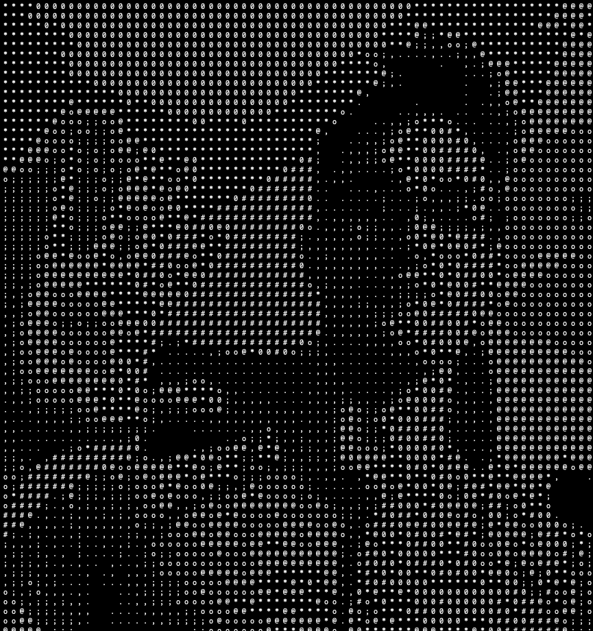

# UnicodeVision
 A program that converts videos and pictures to unicode representation. 
 It works in realtime! You can use it to stream straight from your webcam, or convert an existing video or image to unicode vision! 

# Requirements
- pillow
- numpy
- openCV

```bash
pip install pillow
pip install numpy
pip install openCV
```
# Usage

By default, running UnicodeVision.py will stream from your webcam.
```bash
python3 UnicodeVision.py  
```

You may also process and save a video/image by changing the mode to u (upload)
```bash
python3 UnicodeVision.py  --mode u --path /path/to/image/or/video
```

There are many arguments to play with:
```bash
python3 UnicodeVision.py  --mode s --scale 0.07 --contrast 1 --sharpen 1 --invert False
```

#Just Have Fun!




